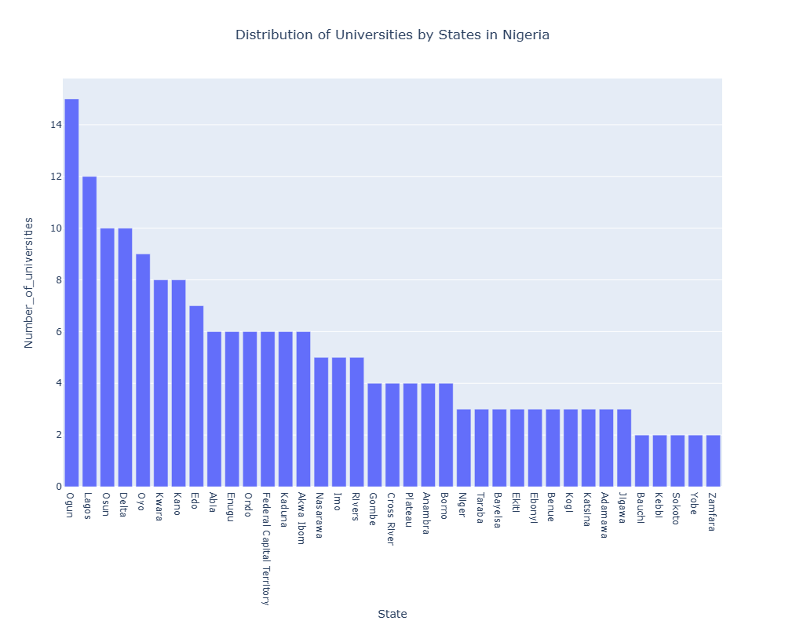
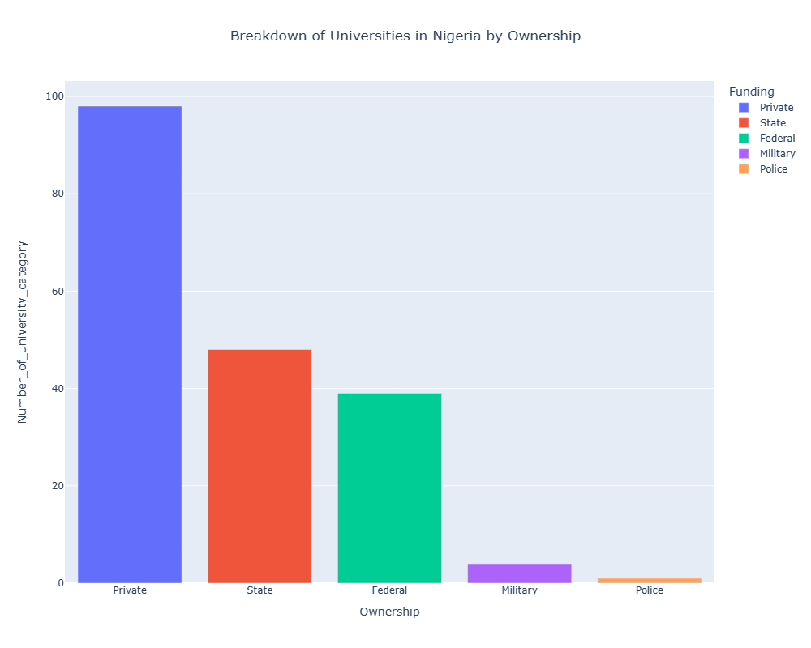
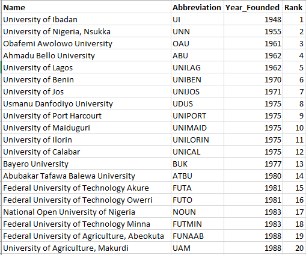
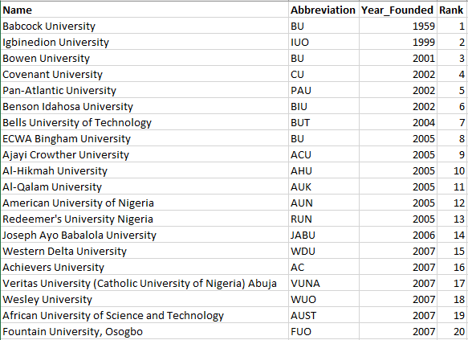
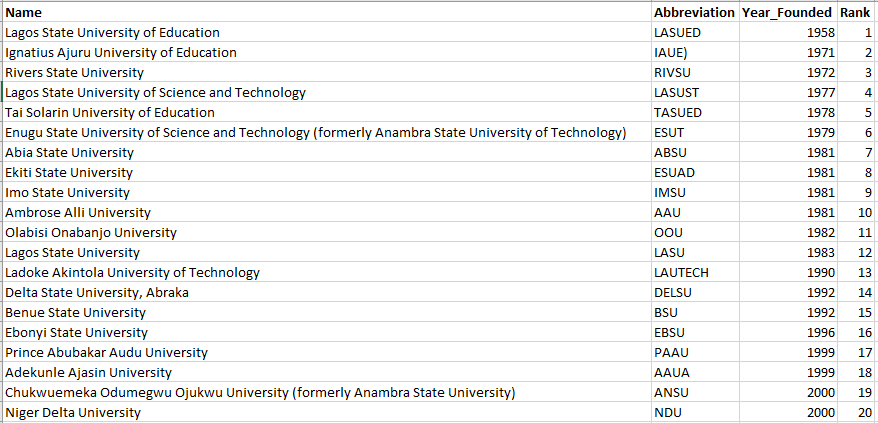
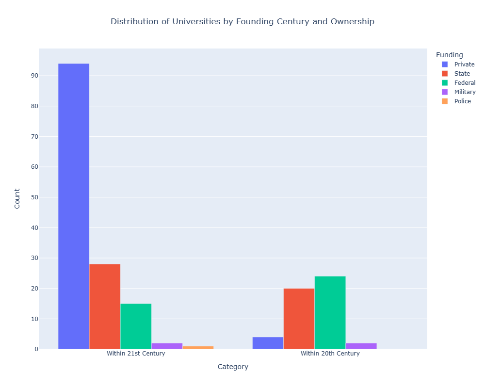
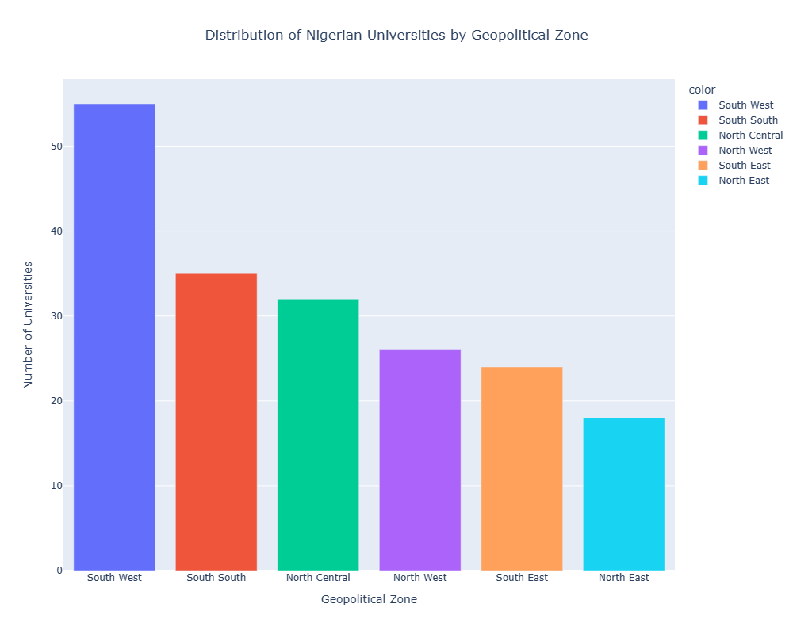
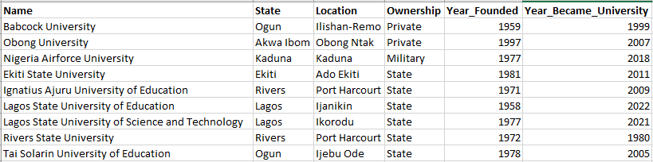

# NAVIGATING NIGERIA'S EDUCATIONAL TERRAIN: A DATA-DRIVEN EXPLORATION OF UNIVERSITIES VIA WIKIPEDIA

## ABOUT THE PROJECT

Nigeria is home to an impressively rich and diverse university system that will undoubtedly shape the nation's future. This research explores the realm of universities in Nigeria, including state, federal, private, and even uniformed establishments. It is essential to comprehend this educational environment. It enables one to examine the variety of educational options accessible and obtain understanding of the general state of Nigeria's higher education system.

The goal of this project is to produce a useful resource for anybody interested in Nigerian institutions by extracting data from Wikipedia. I'll be analyzing this data to find intriguing patterns and ideas that will guide one through the fascinating landscape of Nigerian education.

## DATASET

This project's dataset was obtained by scraping public information from the Wikipedia page [Click_here.](https://en.wikipedia.org/wiki/List_of_universities_in_Nigeria) This webpage provides a comprehensive list of Nigerian universities categorized by ownership (federal, state, private, and uniformed).

Data Description: The scraped data includes the following attributes for each university:
- Name
- State
- Abbreviation
- Location
- Funding type (federal, state, private, uniformed)
- Year established

  During data manipulation, two additional columns were created:
- Year became university: This indicates if the institution was originally not a university but later gained university status, and the year it occurred.
- Later became university: This is a binary variable (Yes/No) signifying whether the institution transitioned to university status at a later date.

## DATA PROCESSES INVOLVED

1. Data Acquisition through Web Scraping
2. Data Cleaning
3. Data Exploration
4. Data Manipulation
5. Data Analysis 
6. Documentation

## PYTHON LIBRARIES USED
1. Requests
2. BeautifulSoup
3. Pandas
4. Plotly

## ANALYSIS & QUESTIONS

Nigeria's University Landscape: A Total of 190 Universities

1. Distribution of Universities by States in Nigeria

  

2. Breakdown of Universities in Nigeria by Ownership

  

3. Historical Trend of University Establishment in Nigeria (1948-2022)

  .png)

4. Top 20 Federal Universities in Nigeria by Year of Establishment

   

5. Top 20 Private Universities in Nigeria by Year of Establishment

  

6. Top 20 State Universities in Nigeria by Year of Establishment

  

7. Distribution of Universities by Founding Century (20th vs. 21st)

.png.png)

8. Distribution of Universities by Founding Cetury and Ownership

  

9. Distribution of Universities by Geopolitical Zone in Nigeria

  

10. Institutions Granted University Status Later

  

## CONCLUSION
Overall, this analysis has provided a detailed picture of Nigeria's university landscape, offering valuable insights for stakeholders in the educational sector. This information can be leveraged for informed decision-making regarding resource allocation, infrastructure development, and future university establishment strategies.

## RECOMMENDATION
More data should be provided on varying courses offered by these universities, annual population of students, etc to aid in further analysis.
